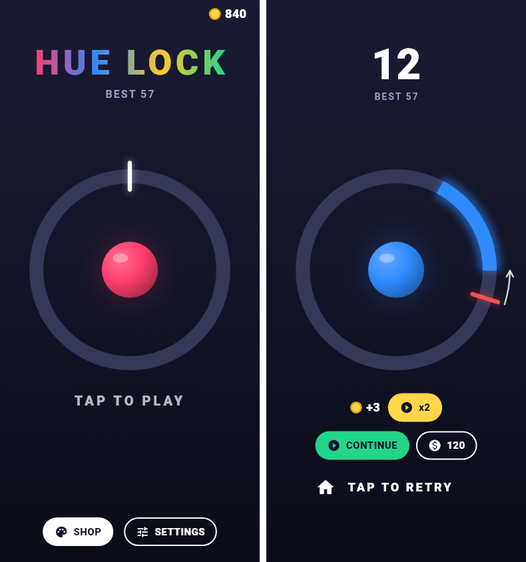
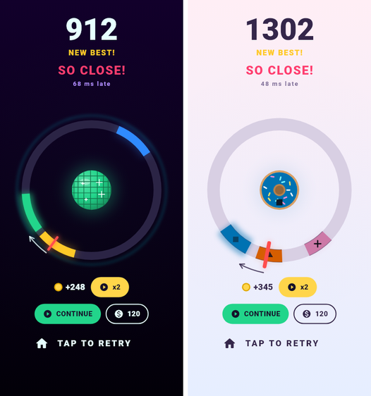
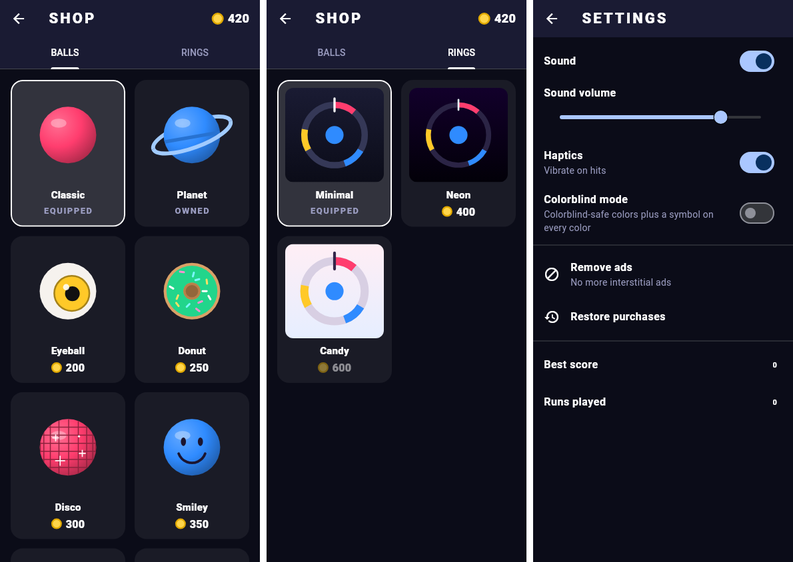

# Hue Lock

An endless one-tap color timing game for **iOS and Android**. A pointer sweeps
around a ring; tap when it is over the zone that matches the ball's color.
Hit and the next round gets a little harder; miss and the run is over.

The full design spec is in [`docs/hue-lock-design.md`](docs/hue-lock-design.md).
This repository implements its **MVP milestone** (design doc section 15).

| Home & game over | Neon / Candy (colorblind mode) | Shop & settings |
|---|---|---|
|  |  |  |

## What makes a run

- **One-lap fuse.** Hit the target on the pointer's first pass. A ring
  around the ball burns down, and waiting a lap is a miss ("TOO SLOW").
- **Fast ramp.** Something new every 6–8 rounds:
  - 0: one color.
  - 6: two colors.
  - 12: the pointer reverses.
  - 18: decoys and **NOT** rounds (hit any color *except* the ball's).
  - 26: the ring spins and **ghost** zones blink in and out.
  - 34: **split** balls (hit both colors in order in one lap).
  - 42: **surge** pointer (its speed swings).
  - 55: everything mixed.
- **Lock sets.** Clear 2–5 rounds in a row (pips above the ball) for a set
  bonus.
- **Fever.** 5 Perfects in a row means double points, a faster pointer and
  full music. One Good ends it.
- **Greedy zones.** A thin gold-rimmed zone of the ball's color, worth +5.
  It sits before the safe zone, so you choose between safe and greedy.
- **Power-ups.** These ride on targets:
  - **Shield:** absorbs one miss.
  - **Slow-mo:** the next 4 rounds are slower.
  - **Wide:** zones are bigger for 5 rounds.
- **Boss rounds** every 25 levels. A color sequence flashes in the ball,
  then you hit it in order on four zones.
- **Stages.** Every 20 levels the run enters a new stage (Dawn, Neon Reef,
  Ember, Aurora, Nebula, Void, …). Each has its own background tint and a
  banner, and the music gets faster.
- **Adaptive music.** Four stacked layers build with the run, Fever plays
  the full mix, and a miss cuts it to silence.

Everything above is tunable in `assets/config/game_config.json`.

## Engine

**Flutter** (Dart). It is one codebase for iOS and Android, it has a small
download size and fast startup, and Google Mobile Ads and in-app purchases are
officially supported. The game is only vector shapes, so it is drawn directly
with a `CustomPainter` driven by a `Ticker`. No game-engine dependency is
needed. This settles the "Engine" open decision (section 19). The game logic
is plain Dart with no Flutter dependencies, so it can move to Flame later if
needed.

## Running

```sh
flutter pub get
flutter run            # on a connected iOS or Android device / emulator
flutter test           # unit + widget tests
flutter analyze
```

Requires Flutter 3.47+ (Dart 3.13+). Android minSdk is 24 because of
`google_mobile_ads`. The iOS deployment target is 15.0.

## What's in the MVP

| Design doc item | Where |
|---|---|
| Ring, pointer, ball, one-tap hit detection with grace margin | `lib/game/hit_judge.dart`, `lib/render/game_painter.dart` |
| Hits judged at the **input event timestamp**, not the next frame | `GameScreen._tapTime`, `ActiveRound` (angles are analytic in time) |
| Perfect / Good / Miss, perfect-combo multiplier (x2, x3 … x5) | `GameEngine._onHit` |
| "SO CLOSE!" with ms early/late | `judgeTap`, game-over overlay |
| Difficulty ramp: 1 color, then smaller and faster, then 2 colors, then reversing pointer, then 3–4 colors with decoys, then rotating ring, then a mix of everything | `assets/config/game_config.json` (`stages`) |
| Wave ramp with "breather" rounds | `Difficulty.forLevel` |
| Fairness guarantee (target always at least the reaction time ahead, always wide enough, ring spin capped) | `RoundGenerator.validate`, tested over 10k rounds |
| Seeded, cross-platform deterministic rounds (Daily Challenge / duels / replay validation ready) | `SeededRandom` (mulberry32) |
| Instant restart (state reset in memory, no scene reload) | `GameEngine.startRun` |
| Death freeze-frame showing pointer vs. target | `GamePainter._paintMissGuide` |
| Juice: lock flash, particles, ball snap, Perfect screen pulse, glow rising with combo and score, screen shake | `lib/game/effects.dart` |
| Best score, coins per run, coin zones on the ring | `GameEngine`, `ProfileStore` |
| 8 ball skins and 3 ring themes (2 to buy), bought with coins | `lib/render/ball_skins.dart`, `ring_themes.dart`, `lib/ui/shop_screen.dart` |
| Continue once per run (rewarded ad **or** coins) with a 3-2-1 countdown | `GameEngine.continueRun` |
| Rewarded "x2 coins" | game-over overlay |
| Interstitials every N runs, **only on the way back to home**, never in the first runs | `AdPolicy` |
| Remove ads (non-consumable IAP) and restore purchases | `lib/services/purchase_service.dart` |
| GDPR / ATT consent via Google UMP | `MobileAdsService.init` |
| Colorblind mode (Okabe-Ito palette and a symbol per color) | `lib/render/palette.dart` |
| Sound: lock click, rising-pitch Perfects, fail, coin, new best | `lib/services/feedback.dart`, `tool/generate_sounds.py` |
| Haptics, sound toggle and volume | settings screen |
| Local save and on-device analytics (death-score histogram, runs per session, continues, ads) | `ProfileStore`, `LocalAnalytics` |
| Pause safety: leaving the app mid-run freezes the pointer behind a countdown | `GameEngine.pause` |
| Portrait only, 120 Hz on ProMotion iPhones | `Info.plist`, `AndroidManifest.xml` |

### Tuning

All gameplay numbers live in [`assets/config/game_config.json`](assets/config/game_config.json):
speeds, zone sizes, grace margin, perfect window, reaction time, stage
thresholds, scoring, coin rates, continue cost and ad frequency.
`GameConfig.load(overrides: ...)` deep-merges a remote-config map over it,
so the ramp can be re-tuned without an app update.

Difficulty is driven by **rounds cleared** in the run, not by score. Perfect
hits are worth more and get multiplied, so tying the ramp to score would let
skilled players skip whole stages.

## Project layout

```
lib/
  config/     typed view of game_config.json
  core/       seeded RNG, angle math
  game/       pure game logic: rounds, generator, hit judge, engine, effects
  render/     painter, palette, ball skins, ring themes
  services/   save, audio/haptics, ads, purchases, analytics
  ui/         game screen (+ overlays), shop, settings
assets/       config + sound effects
tool/         generate_sounds.py / generate_music.py (synthesized audio), ci/ scripts
test/         generator fairness, hit judging, engine, widget tests
```

## Before release (not done yet)

- **AdMob:** replace Google's *sample* app ids in `AndroidManifest.xml` and
  `Info.plist`, and the *test* ad units in `AdUnitIds`. Set up the UMP
  GDPR message and IDFA message in AdMob. Add mediation adapters.
- **IAP:** create the `hue_lock_remove_ads` non-consumable in App Store
  Connect and Play Console. Add **server-side receipt validation** (see the
  TODO in `StorePurchaseService`).
- **Android signing** config (release builds currently use the debug key) and
  final application id / bundle id (`com.huelock.hue_lock`).
- App icons, splash screen, store listing, privacy policy, age rating.
- Plug a real analytics backend (Firebase / GameAnalytics) into `Analytics`.
- Replace the synthesized placeholder sounds and music loops with designed
  ones (keep the file names; music_1..4 must share length and tempo).
- Test input latency and frame pacing on low-end Android devices. Some
  Android phones need `flutter_displaymode` to run at 90/120 Hz.
- Settle the open decisions in design doc section 19: name, currencies,
  interstitial frequency (currently 4), exact tuning numbers.

## Later milestones (design doc section 16)

Daily Challenge and leaderboards (the seeded generator is ready for it),
missions, XP, daily rewards, clip sharing and friend challenges, gems, season
pass, Zen mode, shifting zones, mid-round color changes, and per-stage ring
shapes.
