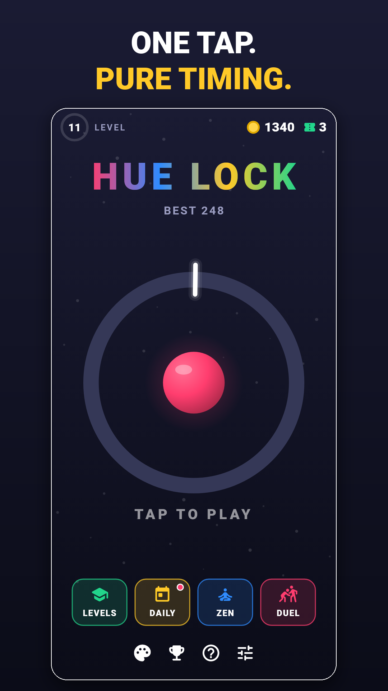
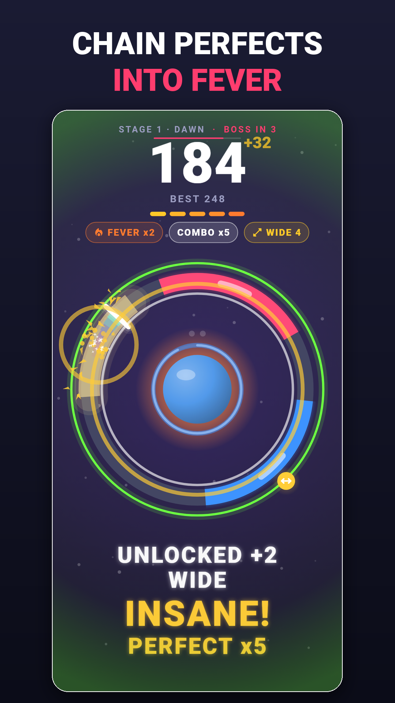
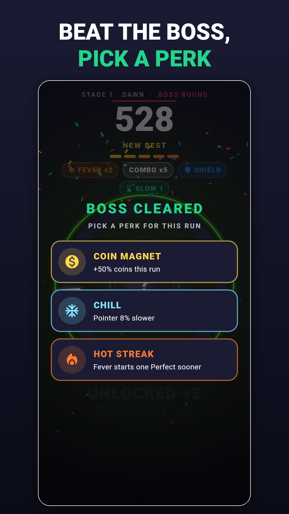
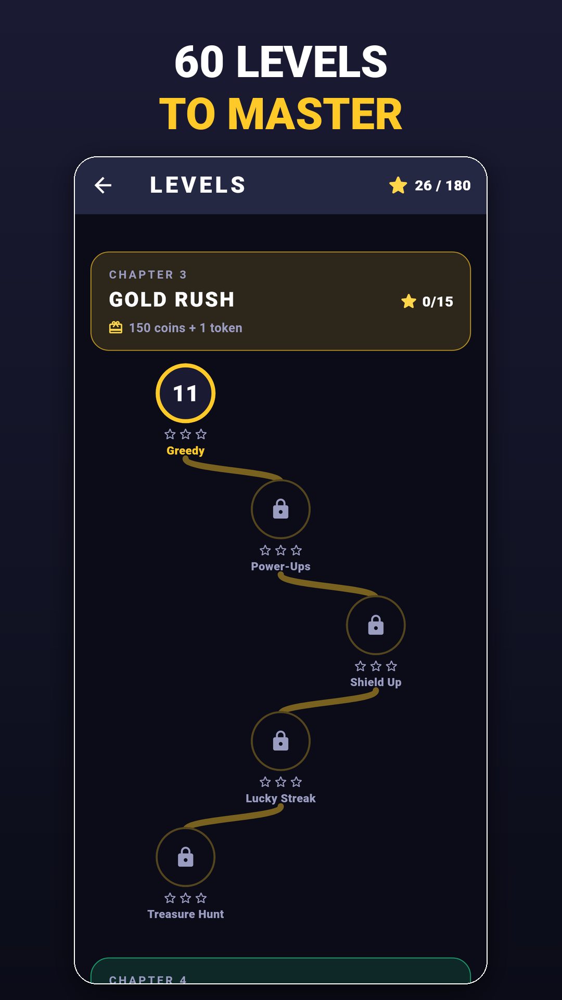

# Hue Lock

An endless one-tap color timing game for **iOS and Android**. A pointer sweeps
around a ring; tap when it is over the zone that matches the ball's color.
Hit and the next round gets a little harder; miss and the run is over.

The full design spec is in [`docs/hue-lock-design.md`](docs/hue-lock-design.md).
This repository implements its **MVP milestone** (design doc section 15) plus
most of the retention and social milestones (section 16): Levels, Daily
Challenge, Zen, friend duels, XP, missions, daily rewards and achievements.
Nothing needs a server: leaderboards, achievements and cloud save use the free
Google Play Games / Game Center services, and duels work with a share code.

| Home | Perfect streak | Perks | Levels |
|---|---|---|---|
|  |  |  |  |

## What makes a run

- **One-lap fuse.** Hit the target on the pointer's first pass. A ring
  around the ball burns down, and waiting a lap is a miss ("TOO SLOW").
- **Gentle ramp.** The pointer starts at 115°/s and gains 1.8°/s per
  round, up to 270°/s (round 86); zones shrink 0.4° per round down to 20°.
  Something new arrives every 8–15 rounds:
  - 0: one color.
  - 8: two colors.
  - 16: the pointer reverses.
  - 26: decoys and **NOT** rounds (hit any color *except* the ball's).
  - 36: the ring spins and **ghost** zones blink in and out.
  - 48: **split** balls (hit both colors in order in one lap).
  - 60: all of the above, more often.
  - 75: everything mixed.
- **Lock sets.** Clear 2–5 rounds in a row (pips above the ball) for a set
  bonus.
- **Fever.** 5 Perfects in a row means double points, a faster pointer and
  full music. One Good ends it.
- **Greedy zones.** A thin gold-rimmed zone of the ball's color, worth +5.
  It sits before the safe zone, so you choose between safe and greedy.
- **Power-ups.** These ride on targets:
  - **Shield:** absorbs one miss.
  - **Slow-mo:** the next 4 rounds are slower.
  - **Wide:** zones are bigger for 5 rounds.
- **Boss rounds** every 15 levels. A color sequence flashes in the ball,
  then you hit it in order on four zones.
- **Perks.** Beating a boss (Endless, Daily, duels) pauses the run to offer
  three of eight perks, which last until the run ends: Steady Hand (wider
  Perfect window), Shield, Chill (slower pointer), Wide Zones, Coin Magnet,
  Hot Streak (Fever one Perfect sooner), Combo Saver (a Good costs one combo
  step, not all of it) and Greed (+50% points, smaller zones). Offers come
  from the seed, so a Daily or duel offers everyone the same choices.
- **Always a next goal.** The HUD shows what's next (boss in N, the next
  stage, or a level's target count) with a hairline progress bar, and turns
  gold when the best score is within reach. The game-over screen shows the
  two things the player is closest to: a new best, the next stage or boss,
  a mission, the next player-level unlock.
- **Stages.** Every 20 levels the run enters a new stage (Dawn, Neon Reef,
  Ember, Aurora, Nebula, Void, …). Each has its own background tint and a
  banner, and the music gets faster.
- **Juice.** Every hit locks the zone and shatters it into shards. Perfects
  add more on top:
  - a camera punch-in, shockwave rings and sparkles (no hit-stop: the
    pointer never pauses, so a Perfect never feels like a frame drop)
  - an edge glow and a richer chime that rises with the streak, plus a
    double-tick haptic
  - streak words ("NICE!", "INSANE!", "GODLIKE!") and a combo-up whoosh
  The Perfect sweet spot is drawn inside every zone (decoys too, so it never
  gives the answer away), a meter shows the
  streak toward Fever, and the score counts up with a "+N" pop. The ball
  morphs into the next color, the pointer leaves a trail, background dust
  speeds up with the combo, and a new best rains confetti.
- **Adaptive music and combo heat.** Four stacked layers follow the
  combo: pad and bass to start, drums once the run is going, the driving
  bass at combo x2, the full mix in Fever. Breaking a combo of x3 or more
  plays a "combo lost" sound and drops the music back; a miss cuts it to
  silence. Each layer has its own preloaded player, so a change is a seek
  and a 300 ms crossfade (changes are at least 1.5 s apart). The ring's
  halo and the pointer trail heat up with the multiplier (x2 cyan to x5
  pink). No effect uses a blur during play: glows are layered strokes and
  radial gradients, so nothing needs an offscreen pass per frame.

- **Time to react.** Nothing new ever starts under the pointer's nose, and
  only a boss round stops the pointer:
  - Before a boss round, the run freezes while the colors are shown one by
    one (longer the first time).
  - NOT and split rounds don't pause. They show a reminder banner, and their
    target starts at least 600 ms ahead of the pointer instead of the usual
    380 ms, or as much of that as fits in the lap at top speed.
  - A split's second color is at least 650 ms behind the first, or it is due
    on the next pass.
  - After a shield save, a fresh round starts behind a 1 s pause.
  - Ghost zones always start visible.

  A mechanic seen for the first time gets a 2.4 s banner with a one-line
  explanation. The run never stops for it: Levels mode is where mechanics
  are taught.

Everything above is tunable in `assets/config/game_config.json`.

## Engine

**Flutter** (Dart). It is one codebase for iOS and Android, it has a small
download size and fast startup, and Google Mobile Ads and in-app purchases are
officially supported. The game is only vector shapes, so it is drawn directly
with a `CustomPainter` driven by a `Ticker`. No game-engine dependency is
needed. This settles the "Engine" open decision (section 19). The game logic
is plain Dart with no Flutter dependencies, so it can move to Flame later if
needed.

## Running

```sh
flutter pub get
flutter run            # on a connected iOS or Android device / emulator
flutter test           # unit + widget tests
flutter analyze
```

Requires Flutter 3.47+ (Dart 3.13+). Android minSdk is 24 because of
`google_mobile_ads`. The iOS deployment target is 15.0.

## What's in the MVP

| Design doc item | Where |
|---|---|
| Ring, pointer, ball, one-tap hit detection with grace margin | `lib/game/hit_judge.dart`, `lib/render/game_painter.dart` |
| Hits judged at the **input event timestamp**, not the next frame | `GameScreen._tapTime`, `ActiveRound` (angles are analytic in time) |
| Perfect / Good / Miss, perfect-combo multiplier (x2, x3 … x5) | `GameEngine._onHit` |
| "SO CLOSE!" with ms early/late | `judgeTap`, game-over overlay |
| Difficulty ramp: 1 color, then smaller and faster, then 2 colors, then reversing pointer, then 3–4 colors with decoys, then rotating ring, then a mix of everything | `assets/config/game_config.json` (`stages`) |
| Wave ramp with "breather" rounds | `Difficulty.forLevel` |
| Fairness guarantee (target always at least the reaction time ahead, always wide enough, ring spin capped) | `RoundGenerator.validate`, tested over 10k rounds |
| Seeded, cross-platform deterministic rounds (Daily Challenge / duels / replay validation ready) | `SeededRandom` (mulberry32) |
| Instant restart (state reset in memory, no scene reload) | `GameEngine.startRun` |
| Death freeze-frame showing pointer vs. target | `GamePainter._paintMissGuide` |
| Juice: lock flash, particles, ball snap, Perfect screen pulse, glow rising with combo and score, screen shake | `lib/game/effects.dart` |
| Best score, coins per run, coin zones on the ring | `GameEngine`, `ProfileStore` |
| 8 ball skins and 3 ring themes (2 to buy), bought with coins | `lib/render/ball_skins.dart`, `ring_themes.dart`, `lib/ui/shop_screen.dart` |
| Continue once per run (rewarded ad **or** coins) with a 3-2-1 countdown | `GameEngine.continueRun` |
| Rewarded "x2 coins" | game-over overlay |
| Interstitials every N runs, **only on the way back to home**, never in the first runs | `AdPolicy` |
| Remove ads (non-consumable IAP) and restore purchases | `lib/services/purchase_service.dart` |
| GDPR / ATT consent via Google UMP | `MobileAdsService.init` |
| Colorblind mode (Okabe-Ito palette and a symbol per color) | `lib/render/palette.dart` |
| Sound: lock click, rising-pitch Perfects, fail, coin, new best | `lib/services/feedback.dart`, `tool/generate_sounds.py` |
| Haptics, sound toggle and volume | settings screen |
| Local save and on-device analytics (death-score histogram, runs per session, continues, ads) | `ProfileStore`, `LocalAnalytics` |
| Pause safety: leaving the app mid-run freezes the pointer behind a countdown | `GameEngine.pause` |
| Portrait only, 120 Hz on ProMotion iPhones | `Info.plist`, `AndroidManifest.xml` |

### Tuning

All gameplay numbers live in [`assets/config/game_config.json`](assets/config/game_config.json):
speeds, zone sizes, grace margin, perfect window, reaction time, stage
thresholds, scoring, coin rates, continue cost and ad frequency.
`GameConfig.load(overrides: ...)` deep-merges a remote-config map over it,
so the ramp can be re-tuned without an app update.

Difficulty is driven by **rounds cleared** in the run, not by score. Perfect
hits are worth more and get multiplied, so tying the ramp to score would let
skilled players skip whole stages.

## Project layout

```
lib/
  config/     typed view of game_config.json
  core/       seeded RNG, angle math
  game/       pure game logic: rounds, generator, hit judge, engine, effects
  render/     painter, palette, ball skins, ring themes
  meta/       XP, missions, achievements, daily challenge, duel codes, levels
  services/   save, audio/haptics, ads, purchases, analytics, Play Games /
              Game Center, local reminders
  ui/         game screen (+ HUD, home and game-over overlays), levels,
              progress, how to play, shop, settings
assets/       config (game_config.json, levels.json) + sound effects
tool/         generate_sounds.py / generate_music.py (synthesized audio), ci/ scripts
test/         generator fairness, hit judging, engine, modes, levels,
              progression, widget tests
```

## Modes

| Mode | What it is | Where |
|---|---|---|
| **Endless** | The high-score mode (tap on home). New mechanics and NOT / split rounds show a banner but never freeze the run; only boss rounds pause. | `GameEngine` (`RunMode.endless`) |
| **Levels** | A map of 60 short levels in 12 chapters (generated by `tool/generate_levels.py`). Each chapter opens with a lesson for one mechanic (basics, reverse, gold and power-ups, NOT, decoys, spin, ghosts, split, Fever, boss memory, combos, mastery), and difficulty rises slowly and evenly across the map. Clearing a level is one star; each of its two goals ("Hit 5 Perfects", "Finish with a shield", ...) is another, and stars stay earned across tries. A chapter opens at a total star count, and clearing it gives a reward once: coins, tokens, or a ball or ring you can't buy (Bullseye, Swirl, Superstar, Sunset, Deep Sea). Every star in a chapter adds a bonus. | `assets/config/levels.json`, `lib/meta/levels.dart`, `lib/game/star_goals.dart`, `lib/ui/levels_screen.dart` |
| **Daily Challenge** | The same seeded run for everyone today, on the Pacific-time day that matches Play Games daily leaderboards. One free attempt, plus up to 2 more for a rewarded ad. No continues. | `dailyChallengeDay` / `dailySeed` in `lib/meta/progression.dart` |
| **Zen** | No game over and no score. A miss just resets the streak. | `GameEngine._onMiss` |
| **Duel** | "Challenge a friend" shares a score image and a code like `HL-4F7KQ2MXA9C`, which holds the run's seed and the score to beat (with a checksum). The friend pastes it in DUEL and plays the exact same run. | `DuelCode`, `lib/ui/mode_dialogs.dart` |

## Progression

- **XP and player levels.** Every run gives XP. Level-ups give coins, and
  milestone levels unlock balls and rings (3, 5, 8, 10, 12, 15).
- **Missions.** Three at a time, each with a coin and XP reward; a claimed
  mission is replaced.
- **Daily login reward.** A 7-day streak (days 4 and 7 add continue tokens).
- **Achievements.** 19 of them, mirrored to Play Games / Game Center once
  configured.
- **Continue tokens.** Spend one instead of an ad or coins.
- **Starter Pack.** A one-time IAP: remove ads, 1000 coins, 5 tokens and the
  exclusive Crown ball.
- **Daily reminder.** An opt-in local notification (Settings). It needs no
  push server.
- **Stats** and everything else are on the Progress screen (trophy icon on
  home).

## Releasing

The app is ready for the stores. **[docs/RELEASE.md](docs/RELEASE.md)** is
the step-by-step guide: accounts, AdMob ids, the upload key, creating the
listing and uploading. Everything for the listing (texts, data safety
answers, icon, feature graphic, screenshots) is in
[docs/store/](docs/store/listing.md).

- **Package / bundle id:** `com.nwbn.huelock`.
- **Version:** `pubspec.yaml` sets the version name (1.0.0). The build number
  is the CI run number, so every build can be uploaded.
- **Builds:** each CI run publishes:
  - `hue-lock.apk`: for testing, always with test ads.
  - `hue-lock.aab`: for Google Play, with real ads and signed with your
    upload key once its secrets are set.
- **Icons and splash:** generated by `tool/generate_icon.py`.

Later improvements, none of them needed for launch:
- Server-side receipt validation (see the TODO in `StorePurchaseService`).
- A real analytics backend behind `Analytics`.
- Designed sounds and music to replace the synthesized ones. Keep the file
  names; music_1..4 must share length and tempo.
- Mediation adapters for AdMob.

### Leaderboards, achievements, cloud save (free)

Google Play Games / Game Center, no server of our own:
- **Leaderboards:** Endless best, Daily Challenge and total Level stars,
  each with daily, weekly and all-time views.
- **Competition in the game:** the home screen shows this week's Endless
  rank, and the game-over screen shows the points needed to pass the player
  just above.
- **Cloud save:** progress is merged with the cloud copy at startup (nothing
  is lost on either side), then saved after every run and when the app goes
  to the background. Settings shows the last save and syncs on tap.

They switch on once the game exists in Play Games Services:
[docs/RELEASE.md](docs/RELEASE.md), section 4. Until then the app runs
without them.

## Not done (and why)

- **Clip sharing (video).** Recording and encoding a replay needs native
  video code on both platforms. Sharing a score image with a duel code covers
  the "challenge a friend" loop without it.
- **Gems and season pass.** A second currency is still an open decision in
  design doc section 19, and a season pass needs ongoing content. The
  progression above is the base either one would build on.
- Shifting zones, mid-round color changes and per-stage ring shapes are
  still ideas.
